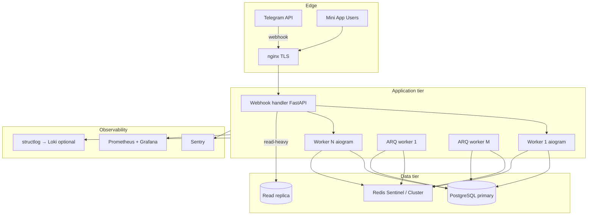

# ECC Strategy для OutstaffingBot

Стратегия агентной оркестрации и долгосрочного развития harness на базе [ECC](https://github.com/affaan-m/ECC) (Everything Claude Code). Заменяет Ruflo, который удалён из проекта.

**Связанные документы:** [PLAN.md](./PLAN.md), [DEVELOPMENT_WORKFLOW.md](./DEVELOPMENT_WORKFLOW.md), [GIT_WORKFLOW.md](./GIT_WORKFLOW.md).

---

## 1. Почему ECC вместо Ruflo

| Критерий | Ruflo | ECC |
|----------|-------|-----|
| Статус в проекте | Не инициализирован, MCP в ошибке | Активная OSS-экосистема, 200k+ stars, Cursor-native |
| Cursor | Через отдельный MCP daemon | `.cursor/` rules, agents, skills, hooks, `install.ps1 --target cursor` |
| Оркестрация | `swarm_init`, proprietary MCP | `orch-*` skills, worktrees, tmux, `plan-orchestrate` |
| Память / instincts | `data/ruflo-memory`, daemon | `continuous-learning-v2`, instincts, `~/.cursor/ecc` (изоляция от Claude Code) |
| Безопасность | `security scan` через MCP | `security-review`, `security-scan`, AgentShield (`ecc-agentshield`) |
| Python / Postgres | Общие агенты | `python-patterns`, `postgres-patterns`, `fastapi-patterns`, dedicated reviewers |
| Установка | `npx ruflo init` + daemon | Selective install: profiles + `--with` components, без daemon-зависимости |
| Bloat risk | `--full` init копирует много артефактов | Manifest-driven: `minimal`, `developer`, точечные `capability:*` |

**Вывод:** Ruflo не давал стабильной ценности в greenfield (daemon, MCP, память не работали). ECC покрывает тот же класс задач (multi-agent, memory, security, TDD) с явным контролем объёма установки и нативной поддержкой Cursor.

---

## 2. Рекомендуемый профиль установки

### Рекомендация: **Custom (на базе `developer`)**

Не ставить `full` — избыточно для Telegram-бота (prediction markets, healthcare, supply-chain, media-generation и т.д.).

| Профиль ECC | Когда | Содержимое |
|-------------|-------|------------|
| `minimal` | Только rules/agents/commands, без hooks | Phase 0 scaffold, если hooks мешают |
| `core` | Baseline + hooks | Альтернатива developer без framework/database |
| **`developer`** | **Основной для OutstaffingBot** | + `framework-language`, `database`, `orchestration` |
| `security` | Аудит перед prod | + security module, без orchestration |
| `full` | **Не рекомендуется** | Всё — bloat |

**Hooks runtime profile** (env `ECC_HOOK_PROFILE`):

- Phase 0–2: `standard` (по умолчанию)
- Phase 8+ (prod team): `strict`
- Отладка / CI-only: `minimal`

**Изоляция памяти Cursor** (не смешивать с Claude Code на одной машине):

```powershell
[Environment]::SetEnvironmentVariable('ECC_AGENT_DATA_HOME', "$HOME\.cursor\ecc", 'User')
```

---

## 3. Команды установки (Windows PowerShell)

Выполнять **в корне OutstaffingBot** или глобально — по выбору. Не смешивать `/plugin install ecc@ecc` с полным `npx ecc-install --profile full` (дубликаты).

### 3.1. Предпросмотр (без установки)

```powershell
cd "c:\Users\Nikita\Desktop\AI MS\OutstaffingBot"

# Клонировать ECC один раз (опционально, для локального install.ps1)
git clone https://github.com/affaan-m/ECC.git .ecc-vendor
cd .ecc-vendor
npm install --no-audit --no-fund

# Предпросмотр плана установки для Cursor
node scripts/ecc.js consult "python fastapi postgres telegram bot" --target cursor
```

### 3.2. Рекомендуемая установка Phase 0 (developer + Cursor)

```powershell
cd "c:\Users\Nikita\Desktop\AI MS\OutstaffingBot"

# Вариант A: npx (без клона)
npx ecc-install --profile developer --target cursor

# Вариант B: из клона ECC
cd .ecc-vendor
.\install.ps1 --profile developer --target cursor
```

### 3.3. Точечное расширение (после developer)

```powershell
# Безопасность (Phase 1–2, перед auth/Mini App)
npx ecc-install --target cursor --with capability:security

# DevOps / деплой (Phase 8)
npx ecc-install --target cursor --with capability:devops

# Языковые rules в проект (копировать в .cursor/rules/ecc/)
npx ecc-install --target cursor lang:python lang:typescript framework:react
```

### 3.4. Hooks отдельно (если начали с minimal)

```powershell
.\install.ps1 --target cursor --modules hooks-runtime
```

### 3.5. AgentShield (Phase 8+)

```powershell
npx ecc-agentshield init
npx ecc-agentshield scan
```

### 3.6. Проверка и сброс

```powershell
node scripts/ecc.js list-installed
node scripts/ecc.js doctor
node scripts/ecc.js repair
node scripts/uninstall.js --dry-run   # только ECC-managed файлы
```

---

## 4. Tier roadmap (компоненты ECC × фазы PLAN.md)

### Tier 1 — Установить в Phase 0 (Foundation)

| Компонент | Тип | Зачем для OutstaffingBot | Когда |
|-----------|-----|--------------------------|-------|
| `baseline:rules` | rules | Единые coding standards, hooks guidelines | Phase 0 |
| `baseline:agents` | agents | `architect`, `planner`, `code-reviewer`, `tdd-guide` | Phase 0 |
| `baseline:commands` | commands | `/plan`, `/tdd`, `/verify`, `/code-review` | Phase 0 |
| `baseline:workflow` | skills | `tdd-workflow`, `verification-loop` | Phase 0 |
| `lang:python` | rules/skills | `python-patterns`, `python-testing` | Phase 0 |
| `lang:typescript` | rules/skills | Mini App React/TS | Phase 0 |
| `framework:react` | skills | `frontend-patterns` для Mini App | Phase 0 |
| `capability:database` | skills | `postgres-patterns` | Phase 0 |
| `skill:fastapi-patterns` | skill | REST + webhook endpoint, async | Phase 0 |
| `agent:python-reviewer` | agent | Backend code review | Phase 0 |
| `agent:fastapi-reviewer` | agent | API layer review | Phase 0 |
| `agent:database-reviewer` | agent | Схема БД, индексы, migrations | Phase 0 |
| `continuous-learning-v2` | skill/hooks | Долгосрочная память паттернов проекта | Phase 0 (hooks on) |

**Hooks Phase 0:** `ECC_HOOK_PROFILE=standard`, pre-commit quality, SessionStart memory.

### Tier 2 — Phase 3–5 (Matching, Notifications, Scale prep)

| Компонент | Тип | Зачем | Когда |
|-----------|-----|-------|-------|
| `redis-patterns` | skill | Кэш matching, ARQ queues, rate limit tokens | Phase 3 |
| `api-design` | skill | Пагинация, idempotency keys, error contracts | Phase 3 |
| `content-hash-cache-pattern` | skill | Кэширование списков вакансий | Phase 3 |
| `orch-add-feature` | skill | Параллельная разработка bot + API + Mini App | Phase 3–5 |
| `orch-pipeline` | skill | Multi-step feature pipelines | Phase 4–5 |
| `plan-orchestrate` | skill | tmux/worktree multi-agent | Phase 4–5 |
| `team-agent-orchestration` | skill | Координация при росте команды | Phase 5 |
| `agent:e2e-runner` | agent | E2E Mini App flows | Phase 5 |
| `skill:e2e-testing` | skill | Playwright / WebApp testing | Phase 5 |
| `agent:performance-optimizer` | agent | Matching SQL, N+1, индексы | Phase 3 |
| `django-celery` | skill | Паттерны очередей (аналог для ARQ: retry, backoff) | Phase 5 |

### Tier 3 — Phase 8+ (Production hardening)

| Компонент | Тип | Зачем | Когда |
|-----------|-----|-------|-------|
| `capability:security` | module | `security-review`, framework security skills | Phase 8 |
| `skill:security-scan` | skill | AgentShield integration | Phase 8 |
| `ecc-agentshield` | CLI | Статический scan агентных конфигов и кода | Phase 8 |
| `capability:devops` | module | `deployment-patterns`, `docker-patterns` | Phase 8 |
| `deployment-patterns` | skill | Blue/green, health checks, graceful shutdown | Phase 8 |
| `docker-patterns` | skill | Multi-stage builds, compose prod | Phase 8 |
| `agent:security-reviewer` | agent | Pre-release security audit | Phase 8 |
| `skill:strategic-compact` | skill | Длинные incident/debug сессии | Phase 8+ |
| `codehealth-mcp` | skill | Code health metrics (если подключён MCP) | Phase 9+ |
| `ECC_HOOK_PROFILE=strict` | env | Жёсткие pre-commit / quality gates | Phase 8+ |

### ecc2 control plane (alpha) — **не сейчас**

`ecc2/` — Rust control plane: `dashboard`, `sessions`, `daemon`, worktree lifecycle. **Статус: alpha.**

| Плюсы | Минусы |
|-------|--------|
| Центральный статус сессий, handoff | Не general release, API может меняться |
| `ecc status --markdown` для handoff | Дополнительный runtime поверх Cursor |
| Worktree orchestration at scale | OutstaffingBot ещё greenfield — overhead |

**Рекомендация:** отложить до Phase 9–10 или при 3+ разработчиков с постоянными parallel agents. До этого — `orch-*` + git worktrees + `plan-orchestrate`.

---

## 5. Top 10 ECC компонентов (долгосрочно)

1. **python-patterns** — единый async style, aiogram/FastAPI conventions
2. **postgres-patterns** — индексы, migrations, read replicas, connection pooling
3. **fastapi-patterns** — REST, deps, webhook handler, OpenAPI для Mini App
4. **tdd-workflow** + **python-testing** — регрессии при росте matching/notifications
5. **api-design** — idempotency, versioning, error model
6. **redis-patterns** — cache, ARQ, distributed rate limiting
7. **deployment-patterns** + **docker-patterns** — prod topology, health checks
8. **security-review** + **security-scan** (AgentShield) — initData, IDOR, secrets
9. **orch-pipeline** / **plan-orchestrate** — замена Ruflo swarm для multi-agent
10. **continuous-learning-v2** — instincts и память между фазами (месяцы разработки)

---

## 6. Отказоустойчивость продукта (не только агенты)

Архитектура приложения при высокой нагрузке и fault tolerance. Дополняет [PLAN.md § B.3](./PLAN.md).



### 6.1. Telegram ingress

| Мера | Детали |
|------|--------|
| Webhook mode | Production only; secret path token; nginx `limit_req` |
| Multiple workers | Несколько процессов aiogram за webhook (или один dispatcher + horizontal API) |
| Rate limiting TG API | Token bucket в Redis; ARQ queue для `send_message`; exponential backoff на 429 |
| Idempotency | `update_id` dedup в Redis; job idempotency keys для notifications |
| Circuit breaker | При серии 5xx от Telegram — pause queue, alert Sentry |

### 6.2. PostgreSQL

| Мера | Детали |
|------|--------|
| Primary + replica | Writes → primary; списки вакансий, matching read → replica (lag-aware) |
| Connection pool | SQLAlchemy pool per service; PgBouncer при >50 conn |
| Migrations | Alembic only; backward-compatible expand-contract |
| Backup | pg_dump daily + WAL archiving (Phase 8) |

### 6.3. Redis

| Мера | Детали |
|------|--------|
| Sentinel / Cluster | Phase 8+: не single-node Redis для prod |
| Roles | DB 0 cache, DB 1 ARQ, DB 2 rate limits |
| TTL | FSM states, cache lists — явные TTL |

### 6.4. Background jobs (ARQ)

| Мера | Детали |
|------|--------|
| Retry | `max_tries`, exponential backoff, dead-letter log |
| Idempotency | `notification:{user_id}:{job_id}` keys |
| Graceful shutdown | SIGTERM handler: finish in-flight, nack rest |
| Scheduler | Отдельный процесс для cron (group posts, cleanup) |

### 6.5. API / Mini App

| Мера | Детали |
|------|--------|
| Health | `/health`, `/ready` (DB + Redis ping) |
| Rate limit | Per `telegram_id` via Redis |
| Circuit breaker | External HTTP (если появятся) via tenacity/pybreaker |

### 6.6. Observability

| Инструмент | Назначение |
|------------|------------|
| structlog | JSON logs, correlation_id per request/update |
| Sentry | Exceptions, performance traces, release tracking |
| Prometheus | RPS, queue depth, TG 429 count, DB pool, Redis memory |
| Alerts | Queue lag > 60s, error rate > 1%, replica lag > 30s |

### 6.7. Deployment

| Мера | Детали |
|------|--------|
| Docker Compose → systemd | Phase 8 MVP prod |
| Zero-downtime | Rolling restart webhook workers; ARQ workers drain |
| Secrets | `.env` / Docker secrets; never in git |
| nginx | TLS, gzip, rate limit, separate static Mini App |

---

## 7. Workflow разработки с ECC (замена Ruflo § E)

**Полное руководство:** [DEVELOPMENT_WORKFLOW.md](./DEVELOPMENT_WORKFLOW.md) — ежедневный цикл, таблица оркестрации, per-phase workflow, anti-patterns.

Краткая схема:

```
Phase kickoff → /plan (или manual subagents) → /tdd → implement → /verify → /code-review
              → security-review (Tier 2+) → PR → CI
              → continuous-learning-v2 (instincts накапливаются)
```

| Фаза PLAN | ECC agents | ECC commands / skills |
|-----------|------------|------------------------|
| Архитектура / БД | `architect`, `database-reviewer` | `/plan`, `postgres-patterns` |
| Backend bot + API | `python-reviewer`, `fastapi-reviewer` | `/tdd`, `python-patterns` |
| Mini App | `react-reviewer`, `typescript-reviewer` | `frontend-patterns` |
| Matching / perf | `performance-optimizer` | `redis-patterns`, `api-design` |
| Notifications | `tdd-guide` | `django-celery` (ARQ patterns) |
| Security | `security-reviewer` | `security-review`, `security-scan` |
| Deploy | — | `deployment-patterns`, `docker-patterns` |
| Multi-agent | `planner`, `chief-of-staff` | `orch-pipeline`, `plan-orchestrate` |

---

## 8. Что НЕ устанавливать (anti-bloat)

| Компонент / модуль | Почему не нужен |
|--------------------|-----------------|
| `full` profile | prediction-markets, healthcare, supply-chain, media-generation, swift-apple, … |
| `capability:machine-learning` | Нет ML в MVP |
| `capability:content`, `social-distribution` | Не контент-бот |
| `capability:prediction-markets` | Не релевантно |
| `healthcare-*` skills | Другой домен |
| `defi-*`, `llm-trading-*` | Другой домен |
| `windows-desktop-e2e` | Mini App web, не native Windows |
| `pytorch-patterns` | Нет DL |
| `ecc2` daemon (alpha) | Пока greenfield / малая команда |
| Дублирование install | Plugin + `npx ecc-install --profile full` вместе |
| Ruflo MCP / `.ruflo/` | Удалено из проекта |

---

## 9. Чеклист Phase 0 (ECC)

- [ ] Удалить Ruflo MCP из Cursor Settings (если был)
- [x] `npx ecc-install --profile developer --target cursor`
- [x] `ECC_AGENT_DATA_HOME=%USERPROFILE%\.cursor\ecc`
- [x] Сохранить Karpathy guidelines и `git-workflow` rules (не из ECC)
- [x] `node scripts/ecc.js doctor` (WARNING drift — OK) — без ошибок
- [ ] Не коммитить `.cursor/ecc-agent-data.json` с секретами (если появится)

---

*Документ создан при миграции с Ruflo на ECC. Установка ECC в проект выполняется явным запросом — этот файл только стратегия.*

---

## 10. Installed on 2026-06-19

| Parameter | Value |
|-----------|-------|
| ECC package | ecc-universal **2.0.0** |
| Git commit | `34faa39bd3cd496a0aece0245f2b7e38b7923abc` |
| Profile | `developer` |
| Extra | `--with capability:security` |
| Target | `cursor` (project `.cursor/`) |
| Install method | Shallow clone `C:\Users\Nikita\AppData\Local\Temp\ECC` + `install.ps1` (`npx ecc` / `npx ecc-install` недоступны в npm) |
| Hooks profile | `ECC_HOOK_PROFILE=standard` |
| Agent data | `ECC_AGENT_DATA_HOME=%USERPROFILE%\.cursor\ecc` (User env) |
| Modules | rules-core, agents-core, commands-core, hooks-runtime, platform-configs, framework-language, database, workflow-quality, security; **orchestration skipped** (конфликт с `capability:security`, см. manifest)

**Doctor (post-install):** WARNING — 2 managed file(s) drifted (ожидаемо: сохранённые project rules `karpathy-guidelines.mdc`, `git-workflow.mdc`).

**Не в профиле (Tier 2–3, по стратегии позже):** `redis-patterns`, `deployment-patterns`, `docker-patterns` — добавить `--with capability:devops` и отдельные skills при Phase 3/8.

**Ruflo:** не устанавливался; отключите MCP **user-ruflo** в Cursor Settings вручную.
